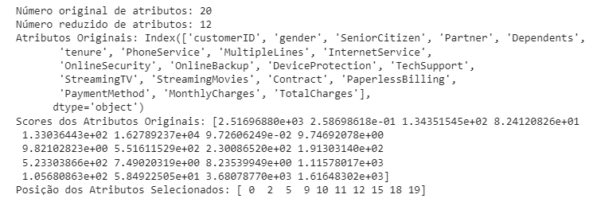
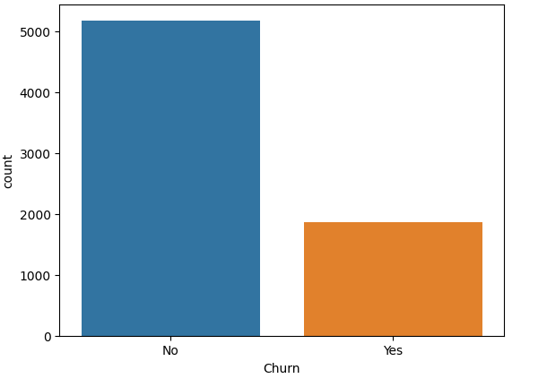
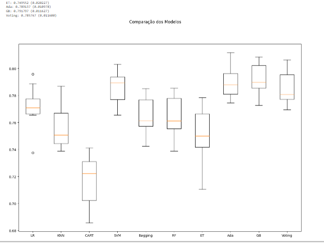
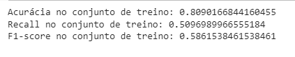
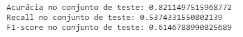
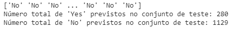

# Machine Learning Problema de Classicação
# Sumário
* [Descrição do projeto](#descrição-do-projeto)
* [Project description](#project-description)
* [Linguagens e tecnologias usadas](#linguagens-e-tecnologias-usadas)
* [Bibliotecas usadas](#bibliotecas-usadas)
* [Análise dos dados e Pré-processamento](#análise-dos-dados-e-pré-processamento)
* [Preparação dos dados](#preparação-dos-dados)
* [Modelagem e treinamento](#modelagem-e-treinamento)
* [Otimização e teste do modelo](#otimizaçã-e-teste-do-modelo)
* [Conclusão](#conclusão)

# Descrição do projeto

Este repositório apresenta um MVP (Minimum Viable Product) elaborado como avaliação para a Sprint II do curso de pós-Graduação em Ciência de Dados e Analytics da Pontifícia Universidade Católica do Rio de Janeiro (PUC-RIO).  

Nosso objetivo é qnalisar todos os dados relevantes dos clientes para prever possíveis "churns". Então, a partir das previsões, criar estratégias mais eficazes para retenção de clientes.

**É importante considerarmos que:**

I - Churn, no contexto de negócios e serviços, refere-se à taxa de perda de clientes ou usuários.;

II - Os churns são uma métrica importante para empresas que oferecem produtos ou serviços com base em assinaturas, contratos ou planos de longo prazo.

III - Compreender os churns é importante para as empresas, pois a aquisição de novos clientes é geralmente mais cara do que a retenção de clientes existentes. lvimento de um modelo preditivo do risco de eventual inadimplência.

Nossa premissa é a de que, com base no conjunto de atributos ou características de clientes, seja possível a criação de um modelo capaz de aprender padrões e relações que possam prever com precisão a perda ou permanência de clientes.

**Atributos do dataset**

customerID: Identificador único de cada cliente.

date: Indica a data em que a avaliação foi feita pelos clientes.

SeniorCitizen: Indica se o cliente é idoso ou não (0 = não idoso, 1 = idoso).

Partner: Indica se o cliente tem parceiro (cônjuge ou companheiro) ou não.

Dependents: Indica se o cliente tem dependentes (filhos ou outros dependentes) ou não.

tenure: Número de meses que o cliente permaneceu como cliente da empresa.

PhoneService: Indica se o cliente possui serviço de telefone ou não.

MultipleLines: Indica se o cliente possui múltiplas linhas de telefone ou não.

InternetService: Tipo de serviço de internet do cliente (DSL, fibra óptica ou sem serviço de internet).

OnlineSecurity: Indica se o cliente possui segurança online ativada ou não.

DeviceProtection: Indica se o cliente possui proteção de dispositivo ativada ou não.

TechSupport: Indica se o cliente possui suporte técnico ativado ou não.

StreamingTV: Indica se o cliente possui serviço de streaming de TV ativado ou não.

StreamingMovies: Indica se o cliente possui serviço de streaming de filmes ativado ou não.

Contract: Tipo de contrato do cliente (um ano, dois anos ou mês a mês).

PaperlessBilling: Indica se o cliente optou por faturamento sem papel ou não.

PaymentMethod: Método de pagamento preferido do cliente.

MonthlyCharges: Valor mensal cobrado ao cliente.

TotalCharges: Valor total cobrado ao cliente.

Churn: Indica se o cliente cancelou o serviço ou não (No = não cancelado, Yes = cancelado).

# Project Description
This repository presents a Minimum Viable Product (MVP) developed as an evaluation for Sprint II of the postgraduate course in Data Science and Analytics at the Pontifical Catholic University of Rio de Janeiro (PUC-RIO).

Our objective is to analyze all relevant customer data to predict possible "churns". Subsequently, based on the predictions, we aim to create more effective strategies for customer retention.

**It is important to consider that:**

I - Churn, in the context of business and services, refers to the rate of customer or user loss.

II - Churns are an important metric for companies that offer products or services based on subscriptions, contracts, or long-term plans.

III - Understanding churns is crucial for companies, as acquiring new customers is generally more expensive than retaining existing ones.

Our premise is that, based on the set of customer attributes or characteristics, it is possible to create a model capable of learning patterns and relationships that can accurately predict customer loss or retention.

**Dataset Attributes**

customerID: Unique identifier for each customer.

date: Indicates the date on which the customer evaluation was made.

SeniorCitizen: Indicates if the customer is a senior citizen or not (0 = not a senior citizen, 1 = senior citizen).

Partner: Indicates if the customer has a partner (spouse or companion) or not.

Dependents: Indicates if the customer has dependents (children or other dependents) or not.

tenure: Number of months the customer has remained as a company customer.

PhoneService: Indicates if the customer has phone service or not.

MultipleLines: Indicates if the customer has multiple phone lines or not.

InternetService: Type of customer's internet service (DSL, fiber optic, or no internet service).

OnlineSecurity: Indicates if the customer has online security enabled or not.

DeviceProtection: Indicates if the customer has device protection enabled or not.

TechSupport: Indicates if the customer has technical support enabled or not.

StreamingTV: Indicates if the customer has TV streaming service enabled or not.

StreamingMovies: Indicates if the customer has movie streaming service enabled or not.

Contract: Type of customer contract (one year, two years, or month-to-month).

PaperlessBilling: Indicates if the customer opted for paperless billing or not.

PaymentMethod: Customer's preferred payment method.

MonthlyCharges: Monthly amount charged to the customer.

TotalCharges: Total amount charged to the customer.

Churn: Indicates if the customer canceled the service or not (No = not canceled, Yes = canceled).

# Linguagens e tecnologias usadas
* Google Colaboratory
* Python 3.11

# Bibliotecas usadas
* Pandas
* Matplotlib
* Seaborn
* NumPy
* Matplotlib
* Plotly
* Time
* Pickle
* Sklearn

# Análise dos dados e Pré processamento 

<figure>
  
</figure>

<figure>
  
</figure>

<figure>
  
</figure>

Nesta estapa de análise exploratória notamos que os dados estão em formato object e float. Isso é relevante para escolhermos mais a frente as técnicas de pré-processamento mais adequadas a esses tipos de dados.
Também notamos que não há valore faltantes ou nulos que possam comprometer a qualidade e o desempenho do modelo.

# Preparação dos dados

<figure>
  
</figure>

Nesta etapa realizamos a seleção das características mais importantes usando o teste qui-quadrado (chi2) e validação cruzada. O objetivo é encontrar o valor ideal de k, que representa a quantidade de características selecionadas. À medida que aumentamos o valor de k, o desempenho médio da validação cruzada também aumenta, indicando que selecionar mais características melhora o modelo de regressão logística. Encontramos o melhor valor de k como sendo 10, o que resultou no maior desempenho médio da validação cruzada, atingindo 0.7934.

O conjunto de dados original contém 20 atributos. Após a seleção de características usando o teste qui-quadrado, restam apenas 12 características mais relevantes. Definimos uma lista com os atributos selecionados com base nos resultados da seleção anterior. Em seguida, criamos um novo DataFrame chamado "input_data" contendo apenas as colunas dos atributos selecionados. Separamos os atributos de previsão (input features) e a classe alvo do DataFrame usando os atributos selecionados.

Para preparar os dados para o modelo de previsão de churn, utilizamos diversos métodos de pré-processamento, como o LabelEncoder, OneHotEncoder, ColumnTransformer e StandardScaler. Esses métodos transformam variáveis categóricas em representações numéricas e garantem que os dados estejam na mesma escala para facilitar a interpretação e melhorar a eficiência do modelo. As características codificadas são então usadas como entrada para o modelo de previsão de churn.

Em resumo, este código realiza a seleção de características, o pré-processamento dos dados e a preparação das entradas para o modelo de previsão de churn utilizando regressão logística. As características selecionadas e os dados transformados melhoram o desempenho do modelo e facilitam a previsão de churn dos clientes no conjunto de dados fornecido.

# Modelagem e treinamento

<figure>
  
</figure>

Nesta etapa, preparamos os dados para a modelagem e avaliação do desempenho do modelo de previsão de churn. Utilizamos a validação cruzada k-fold com 10 partições para avaliar o desempenho do modelo de forma mais robusta. Foram considerados vários algoritmos de classificação, incluindo Regressão Logística, Árvore de Decisão, Random Forest, KNN, SVM, Bagging, AdaBoost, Gradient Boosting e Voting.

Após a avaliação dos resultados, observamos que os modelos AdaBoost e Gradient Boosting apresentaram as maiores médias de acurácia, com valores em torno de 78.91% e 79.18%, respectivamente. Isso indica que esses modelos foram mais precisos na previsão do churn. O modelo SVM também demonstrou um desempenho robusto, com uma média de acurácia de 78.63%.

Considerando os resultados, os modelos de boosting (AdaBoost e Gradient Boosting) e o SVM se destacam como as melhores opções para a previsão de churn, levando em conta as características dos clientes e as vantagens específicas que esses modelos oferecem para o problema em questão.

# Otimização e teste do modelo

<figure>
  
</figure>

<figure>
  
</figure>

Neste trecho de código, realizamos uma busca de hiperparâmetros usando GridSearchCV para encontrar a melhor configuração para o modelo GradientBoostingClassifier. Testamos diferentes valores para o número de estimadores, taxa de aprendizado, profundidade máxima das árvores e outros parâmetros. Encontramos que a melhor configuração inclui uma taxa de aprendizado de 0.1, profundidade máxima das árvores igual a 3, número mínimo de amostras para dividir um nó igual a 2, número mínimo de amostras para serem consideradas uma folha igual a 1 e 100 estimadores (número de árvores).

Após definir os melhores hiperparâmetros, avaliamos o desempenho do modelo no conjunto de teste usando métricas de avaliação. Notamos que a acurácia do modelo foi de aproximadamente 82%, o que significa que ele acertou a classificação de churn ou não churn para cerca de 82% dos clientes no conjunto de teste.

# Conclusão

<figure>
  
</figure>

<figure>
  
</figure>

O modelo apresentou resultados razoavelmente bons, com uma acurácia de aproximadamente 82% no conjunto de teste e uma acurácia ligeiramente menor de 81% no conjunto de treino. Isso indica que o modelo está generalizando bem para dados não vistos e evitando overfitting. O recall, que mede a capacidade do modelo em identificar casos positivos corretamente, também apresentou valores aceitáveis, sendo cerca de 54% no conjunto de teste e 51% no conjunto de treino. O F1-score, que considera a precisão e o recall, também demonstrou um bom equilíbrio entre as métricas nos dois conjuntos.

Entretanto, é importante notar que o modelo pode estar tendo alguma dificuldade em identificar casos positivos, especialmente no conjunto de teste. Isso é evidenciado pelo menor número de previsões positivas no conjunto de teste em comparação com o conjunto de treino. Talvez seja necessário ajustar a seleção de hiperparâmetros ou realizar outras técnicas de otimização para melhorar a capacidade do modelo em identificar casos positivos adequadamente. Em geral, os resultados são promissores, mas existem oportunidades para aprimorar ainda mais o desempenho do modelo.
