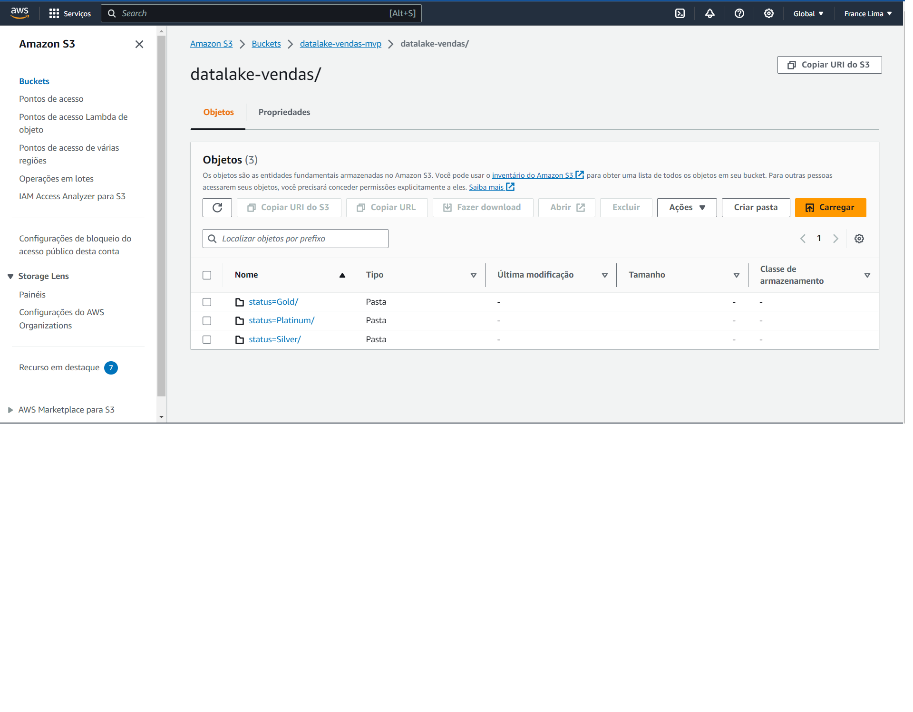

# MVP-Engenharia-de-dados
# Sumário
* [Descrição do projeto](#descrição-do-projeto)
* [Objetivo e problema](#objetivo-e-problema)
* [Coleta e informações dos dados](#coleta-e-informações-dos-dados)
* [Carga e modelagem dos dados](#carga-e-modelagem-dos-dados)
* [Análise](#análise)
* [Autoavaliação](#autoavaliação)
* [Tecnologias e Ferramentas Utilizadas](#tecnologias-e-ferramentas-utilizadas)

  

  
# Descrição do projeto
Este repositório apresenta um MVP (Minimum Viable Product) elaborado como avaliação para a Sprint III do curso de pós-Graduação em Ciência de Dados e Analytics da Pontifícia Universidade Católica do Rio de Janeiro (PUC-RIO).

# Objetivo e problema
O projeto envolve utilizar métodos de engenharia e análise de dados para criar um datalake a partir de arquivos csv e realizar consultas ad hoc para obter insights sobre o perfil de consumo dos clientes, para melhorar sua experiência de satisfação e maximizar o lucro da loja.
Para tal, buscaremos satisfazer a seis problemas de negócio principais:

  * Total de vendas.
  * Total de vendas por categoria.
  * Total de vendas por Estado.
  * Total de vendas por sexo.
  * Total de vendas por status (Gold, Platinum e Silver).
  * Lista dos três vendedores com as maiores receitas. 

# Coleta e informações dos dados

Os dados foram coletados da plataforma [Kaggle](caminho/do/arquivo-ou-pasta) via download e armazenados na plataforma clound da AWS em formato csv.  Cada um dos cinco arquivos contém uma tabela já previamente normalizada. 
Trata-se de uma loja fictícia chamada "CicloMaster" que opera em várias cidades e atende uma comunidade apaixonada por ciclismo. Os clientes variam desde entusiastas ocasionais, até atletas profissionais. Além disso, oferece uma variedade de produtos, incluindo bicicletas, acessórios, roupas e equipamentos.
A loja também possui status "Gold", "Silver" e "Platinum", com benefícios exclusivos para clientes de cada categoria, trabalhando com diversos fornecedores que fornecem produtos de alta qualidade.

**Aributos das tabelas originais**

**Vendas**
IDVenda: Este é um identificador único para cada venda na loja. O tipo de dado é numérico inteiro.
IDVendedor: Este é um identificador único para cada vendedor que realizou a venda. O tipo de dado é numérico inteiro.
IDCliente: Este é um identificador único para cada cliente que fez a compra. O tipo de dado é numérico inteiro.
Data: Esta coluna registra a data e a hora em que a venda foi realizada. O tipo de dado é de data e hora (datetime).
Total: Esta coluna representa o valor total da venda. O tipo de dado é numérico com ponto flutuante (float)

**Produtos**

IDProduto: Este é um identificador único para cada produto. O tipo de dado é numérico inteiro.
Produto: Esta coluna contém o nome do produto. O tipo de dado é uma string (texto).
Preço: Esta coluna representa o preço do produto. O tipo de dado é numérico com ponto flutuante (float).

**Clientes**

IDCliente: Este é um identificador único para cada cliente. O tipo de dado é numérico inteiro.
Cliente: Esta coluna contém o nome do cliente. O tipo de dado é uma string (texto).
Estado: Esta coluna registra o estado onde o cliente está localizado. O tipo de dado é uma string (texto).
Sexo: Esta coluna registra o sexo do cliente. O tipo de dado é uma string (texto).
Status: Esta coluna registra o status do cliente na loja. O tipo de dado é uma string (texto).

**Itensvenda**

IDProduto: Este é um identificador único para cada produto vendido. O tipo de dado é numérico inteiro.
IDVenda: Este é um identificador único para cada venda à qual o item está associado. O tipo de dado é numérico inteiro.
Quantidade: Esta coluna registra a quantidade de um determinado produto vendido em uma venda específica. O tipo de dado é numérico inteiro.
ValorUnitario: Esta coluna representa o valor unitário de um produto vendido. O tipo de dado é numérico com ponto flutuante (float).
ValorTotal: Esta coluna representa o valor total de um determinado produto vendido em uma venda específica. O tipo de dado é numérico com ponto flutuante (float).
Desconto: Esta coluna registra o valor de desconto aplicado ao produto vendido. O tipo de dado é numérico com ponto flutuante (float).

**Vendedores**

IDVendedor: Este é um identificador único para cada vendedor. O tipo de dado é numérico inteiro.
Nome: Esta coluna contém o nome do vendedor. O tipo de dado é uma string (texto).

# Armazenamento dos dados

Para tal, utilizamos o serviço S3 da AWS para criar um bucket com pastas. Abaixo a pasta source com os dados de origem em formato csv que posteriormente serão usados para criar o datalake. 

Criamos também as pastas "datalake-vendas" como a pasta principal,"temp" para os dados temorários, "scripts" e "log". 

# Carga e modelagem dos dados

**Modelagem dos dados**

Para realizar o processo de modelagem, esquematização a catalogação dos dados optamos por usar o AWS Glue. Para tal, criamos um novo database para agrupar os dados armazenados no S3. Em seguida, autilizamos a ferramenta crawler do AWS Glue para agrupar logicamente e verificar o schema dos dados. 
Tratando-se de um datalake, optamos por um schema flat, contendo o conteúdo de cada coluna e os valores minimos e maxímos das principais colunas numéricas.

**Modelagem**
**ETL**
Para carga e transformaçao dos dados optamos pela ferramenta Jobs do AWS Glue Studio. Em seguida utilizamos o Visual blank canvas e acessamos as tabelas armazenadas no Glue.
Construimos a pipeline de transformação realizando "joins" de duas em duas tabelas. Além disso, alteramos os nomes de algum campos para evitar problemas elementos repatidos. Em seguida particionamos a tabela por "Status". 

# Análise

**Qualidade dos dados**
Não verificamos qualquer inconsistência na qualidade dos dados consultados. Não há indício de valores nulos ou faltantes, como apresentado abaixo. 

**Solução do problema**

Como apresentamos, nosso objetivo é compreender mais profundamente o perfil de consumo do cliente para melhorarmos a qualidade do serviço oferecido visando o aumento dos lucros. 
Analisando os resultados das consultas realizadas com base nos indicadores de negócio previamente apresentados, apontamos: 

Total de Vendas: R$ 3,054,162.73

Este valor representa a receita total das lojas de bicicleta e é um indicador-chave do desempenho geral do seu negócio.

Vendas por Categoria:

Bicicleta Gotmetws Endorphine: R$ 700,798.74
Luva de Ciclismo: R$ 761,148.15
Bicicleta Altools Stroll: R$ 1,171,300.06
Bicicleta Gts: R$ 779,647.10
Bicicleta Gometws: R$ 666,036.46
Capacete Gometws: R$ 673,181.78
Bicicleta Aro 29 Mountain Bike Endorphine: R$ 1,127,291.11
Camiseta Predactor: R$ 1,034,207.51
Bermuda Predactor: R$ 980,179.49
Esses valores demonstram que as bicicletas de alto desempenho, como a "Bicicleta Gotmetws Endorphine" e a "Bicicleta Altools Stroll," lideram as vendas, sugerindo uma demanda por produtos premium em sua loja. Itens como "Luva de Ciclismo" também são populares, indicando que acessórios podem ser uma área de oportunidade para aumentar as vendas.

Vendas por Estado do Brasil:

ES (Espírito Santo): R$ 229,299.85
SE (Sergipe): R$ 596,539.57
RO (Rondônia): R$ 49,133.74
MS (Mato Grosso do Sul): R$ 461,453.63
RR (Roraima): R$ 151,073.16
MA (Maranhão): R$ 762,997.76
PI (Piauí): R$ 663,061.97
SP (São Paulo): R$ 370,411.00
DF (Distrito Federal): R$ 456,597.15
CE (Ceará): R$ 28,552.70
PR (Paraná): R$ 165,885.94
PA (Pará): R$ 649,411.64
Esses valores indicam que os estados de Sergipe (SE), Maranhão (MA) e Piauí (PI) apresentam vendas significativas, sugerindo, talvez, a necessidade de expandir ou intensificar o marketing e a presença nessas regiões. Estados como Espírito Santo (ES) e Rondônia (RO) têm vendas mais baixas, e é importante investigar as razões por trás disso e considerar estratégias para melhorar o desempenho nessas áreas.

Vendas por Sexo:

Feminino (F): 560 vendas
Masculino (M): 380 vendas
Esses números mostram que as vendas são ligeiramente inclinadas para o público feminino (F), sugerindo oportunidades de marketing direcionado e seleção de produtos que atendam às preferências das mulheres ciclistas.

Vendas por Status:

Silver: R$ 8,614,493.72
Gold: R$ 177,863.06
Platinum: R$ 49,915.94
Esses valores revelam que as vendas para clientes com status "Silver" são significativamente maiores do que para "Gold" e "Platinum," indicando uma base de clientes substancial no nível "Silver" que pode ser alvo de programas de fidelidade ou recompensas para aumentar o seu envolvimento.

Três Vendedores com Maiores Receitas:

Cpitolino: R$ 1,217,642.47
Helio Liberato: R$ 1,134,726.89
Simão Rivero: R$ 1,064,508.78
Esses números sugerem que os vendedores Cpitolino, Helio Liberato e Simão Rivero desempenham um papel crucial nas vendas da empresa. Estudar suas práticas de vendas e compartilhar suas estratégias com outros vendedores pode ser útil para melhorar o desempenho geral da equipe de vendas.

# Autoavaliação

Em resumo, este projeto foi uma jornada desafiadora. Lidar com as configurações e integrações necessárias para estabelecer o datalake na nuvem foi mais complexo do que inicialmente prevíamos. Tivemos que aprender rapidamente superar alguns desafios técnicos.  Além disso, constatamos o quanto é árdua a tarefa de garantir a qualidade e a integridade dos dados e lidar com formatos variados e o volume de dados.
Para os futuros projetos, pretendemos continuar aprendendo sobre tecnologias em nuvem, aprimorando nossas habilidades em engenharia de dados e análise avançada. Buscar estratégias de qualidade de dados para garantir que os dados brutos sejam confiáveis e precisos. Por fim, invertir em formas de implementar automação para facilitar a ingestão, transformação e análise contínua de dados.

# Tecnologias e Ferramentas Utilizadas:

1. **AWS (Amazon Web Services):** Plataforma em nuvem utilizada para armazenar dados e executar as etapas de ETL.

2. **Amazon S3:** Serviço de armazenamento em nuvem da AWS utilizado para criar o bucket e armazenar os arquivos CSV.

3. **AWS Glue:** Serviço da AWS usado para a catalogação, esquematização e transformação dos dados.

4. **AWS Glue Crawler:** Ferramenta do AWS Glue para agrupar e verificar o schema dos dados, permitindo a criação do catálogo.

5. **AWS Glue Jobs:** Utilizados para executar a pipeline de transformação de dados, incluindo a realização de "joins" e transformações necessárias.

6. **AWS Glue Studio:** Interface gráfica para criar e gerenciar os trabalhos de ETL.

7. **SQL:** Linguagem de consulta estruturada usada para realizar consultas ad hoc nos dados.

8. **Kaggle:** Plataforma de dados utilizada para baixar os conjuntos de dados originais em formato CSV.
